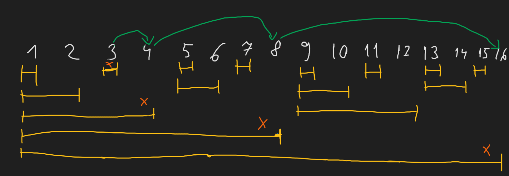
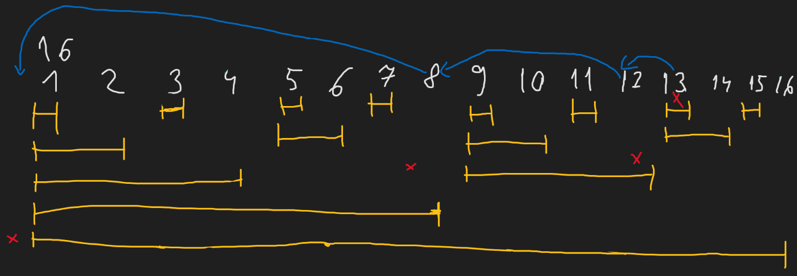

---
tags:
    - structuri de date
    - arbori indexati binar
    - optimizare
---

**Autori**: Ștefan-Cosmin Dăscălescu, Luca Valentin Mureșan

!!! example "Cunoștințe necesare"
    - [Subprograme](../cppintro/functions.md)
    - [Operații pe biți](../mediu/bitwise-ops.md)
    - [Range Minimum Query (RMQ)](./rmq.md)

## Ce este un arbore indexat binar?

Arborii indexați binar (prescurtați de regulă, AIB) sunt o structură de date ce
poate fi folosită pentru a actualiza eficient valori și pentru a calcula sume
parțiale într-un tablou de valori ce poate avea una sau mai multe dimensiuni.

Deși arborii indexați binar nu înlocuiesc vreo structură de date propriu-zisă
(tot ce poate face un AIB poate face și un arbore de intervale), marele lor
avantaj este dat de faptul că implementarea lor este foarte ușoară și constanta
folosită de aceștia este una mult redusă față de arborii de intervale, fiind de
câteva ori mai rapizi și consumând de $2-4$ ori mai puțină memorie, în funcție
de implementare.

## Cum funcționează un Arbore Indexat Binar?

Pentru a putea folosi un AIB, trebuie să folosim un vector, unde aib[i]
reprezintă valoarea pe care o stocăm pe poziția $i$. Așa cum îi zice și numele,
fiecare poziție $i$ va ține rezultatele pe un interval egal cu $2^{zeroes}$,
unde $zeroes$ reprezintă numărul de zerouri de la finalul reprezentării binare a
lui $i$. Această expresie ne ajută să adunăm sau să scădem valoarea celui mai
nesemnificativ bit de 1 din $i$ pentru a putea opera actualizările și
interogările.

Motivul pentru care se folosește reprezentarea binară a nodurilor este acela că
în acest mod, se garantează complexitatea logaritmică a operațiilor menționate
mai sus (update și query), precum și în practică o constantă foarte bună
datorită numărului redus de biți pe care îl au numerele în binar.

!!! info "Observație"

    Arborii indexați binar sunt mereu indexați de la 1, deoarece altfel, am
    avea de-a face cu 0, care nu are un bit nesemnificativ egal cu 1.

### Cum funcționează operația de update?

Să presupunem că avem un AIB cu 16 noduri și vrem să actualizăm valoarea de la
poziția 3. Pentru a putea face asta, vom rula următorul algoritm, cât timp
valoarea curentă nu e mai mare decât numărul de noduri:

- actualizăm valoarea curentă
- aflăm poziția celui mai nesemnificativ bit, să o notăm $lsb$
- adunăm $2^{lsb}$ la valoarea curentă

De exemplu, pentru nodul 3 vom trece prin următoarele poziții, după cum se
poate vedea pe desen:

- 3 - poziția celui mai nesemnificativ bit este 0, adunăm $2^0 = 1$ la
  poziție
- 4 - poziția celui mai nesemnificativ bit este 2, adunăm $2^2 = 4$ la
  poziție
- 8 - poziția celui mai nesemnificativ bit este 3, adunăm $2^3 = 8$ la
  poziție
- 16 - poziția celui mai nesemnificativ bit este 3, adunăm $2^4 = 16$ la
  poziție, algoritmul ia sfârșit.

  <!-- TODO: trebuie sa refac desenul de aici -->



Complexitatea operației de update este $O(\log n)$, unde $n$ este dimensiunea
arborelui indexat binar.

### Cum funcționează operația de query?

În mod similar față de operația de update, operația de query va rula
folosindu-se de reprezentarea binară a poziției de la care vrem să facem
query-ul. Este de remarcat faptul că dacă vrem să rulăm un query pe intervalul
$[L, R]$, va trebui să scădem din rezultatul obținut până la poziția $R$,
rezultatul obținut la poziția $L - 1$, din cauza faptului că informația stocată
în nodurile din AIB nu este suficient de complexă pentru a putea fi obținută cu
o singură rutină de interogare. Totodată, această abordare este similară cu cea
de la sumele parțiale, unde obținerea lor presupune din nou două calcule, în loc
de unul singur.

Mai jos prezint algoritmul general și un exemplu de aplicare al acestuia, pentru
valoarea 13.

- adunăm la rezultat valoarea curentă
- aflăm poziția celui mai nesemnificativ bit, să o notăm $lsb$
- scădem $2^{lsb}$ din valoarea curentă.

De exemplu, pentru nodul 13 vom trece prin următoarele poziții, după cum se
poate vedea pe desen:

- 13 - poziția celui mai nesemnificativ bit este 0, scădem $2^0 = 1$ din
  poziție
- 12 - poziția celui mai nesemnificativ bit este 2, scădem $2^2 = 4$ din
  poziție
- 8 - poziția celui mai nesemnificativ bit este 3, scădem $2^3 = 8$ din
  poziție, am ajuns la 0, deci calculul ia sfârșit.



Complexitatea operației de query este $O(\log n)$, unde $n$ este dimensiunea
arborelui indexat binar.

## Implementarea în C++

Un mare avantaj al arborilor indexați binar este acela că implementarea lor este
una foarte scurtă, fiind necesare doar câteva rânduri pentru a putea fi
implementați.

```cpp
long long fenwick[100002];
void update(int node, int value) {
    for (int i = node; i <= n; i += (i & (-i))) {
        fenwick[i] += value;
    }
}
long long compute(int node) {
    long long ans = 0;
    for (int i = node; i > 0; i -= (i & (-i))) {
        ans += fenwick[i];
    }

    return ans;
}
```

## Probleme rezolvate

### Problema [inv](https://infoarena.ro/problema/inv)

Se dă un şir $S$ de lungime $n$ cu numere întregi. Numim o inversiune o pereche
de indici $(i, j)$ astfel încât $1 \leq i < j \leq n$ şi $S_i > S_j$. Să se
determine câte inversiuni sunt în şirul dat.

Pentru a rezolva această problemă, putem folosi orice structură de date ce ne
permite să actualizăm valoarea unei poziții și să rulăm interogări de sumă pe un
interval. În cazul problemei noastre, vom vrea pentru fiecare valoare din șir să
aflăm numărul de valori de la stânga care sunt mai mari decât valoarea curentă,
lucru ce se poate realiza aflând pentru valoarea curentă, poziția ei în șirul
sortat și procesând un query de sumă pe intervalul $[poz + 1, n]$, unde $poz$
este poziția în vectorul sortat a celei mai din dreapta valori din șir egală cu
valoarea de la poziția curentă.

Deoarece valorile din șir sunt destul de mari, trebuie să [normalizăm
datele](../mediu/data-normalization.md),
iar mai apoi să folosim AIB pentru a rezolva problema.

```cpp
#include <fstream>
#include <algorithm>
#include <vector>

using namespace std;

vector<int> fenwick, vals, sorted, pos;

bool cmp (int a, int b) {
    return vals[a] < vals[b];
}

void add (int n, int node, int val) {
    for (; node <= n; node += (node & (-node))) {
        fenwick[node] += val;
    }
}

int compute (int node) {
    int ans = 0;
    for (; node; node -= (node & (-node))) {
        ans += fenwick[node];
    }
    return ans;
}

int main() {
    
    ifstream cin("inv.in");
    ofstream cout("inv.out");
    
    int n;
    cin >> n;
    
    fenwick.resize(n+1); 
    vals.resize(n+1); 
    sorted.resize(n+1);
    pos.resize(n+1);
    
    for (int i = 1; i <= n; i++) {
        cin >> vals[i];
        sorted[i] = i;
    }
    
    sort(sorted.begin() + 1, sorted.begin() + n + 1, cmp);
    int cnt = 0;
    for (int i = 1; i <= n; i++) {
        if (i == 1 || vals[sorted[i]] > vals[sorted[i-1]]) {
            cnt++;
        }
        pos[sorted[i]] = cnt;
    }
    
    long long ans = 0;
    for (int i = 1; i <= n; i++) {
        ans += i - compute(pos[i]) - 1;
        add(n, pos[i], 1);
    }
    
    cout << ans%9917 << '\n';
    return 0;
}
```

### Problema [Goal Statistics](https://kilonova.ro/problems/960)

Se dau $q$ operații, operația de update adaugă o valoare egală cu $k$, iar
operația de query cere suma celor mai mici $p$ valori din șir.

Această problemă este din nou un exemplu clasic de folosire a structurilor de
date, iar încă o dată, arborii indexați binari se dovedesc a fi soluția
potrivită pentru această problemă, datorită vitezei de implementare și a
ușurinței de folosire. Pentru a afla suma celor mai mici $p$ valori din șir, vom
căuta binar răspunsul, folosind o metodă similară cu cea descrisă mai sus. Deși
căutarea binară naivă în $O(\log^2 n)$ ia punctajul maxim, se recomandă căutarea
binară în $O(\log n)$.

Pentru a căuta binar în AIB în $O(\log n)$, vom folosi o tehnică similară cu
[căutarea binară pe
biți](../usor/binary-search.md#cautarea-binara-a-lui-mihai-patrascu), verificând
dacă adăugarea a $2^k$ poziții în AIB ne-ar duce peste valoarea cerută sau nu.

```cpp
#include <iostream>
using namespace std;

const int max_val = 1000000;
int q;

int fen[max_val + 2];
long long sum[max_val + 2];

void upd(int pos) {
    int init = pos;
    for(; pos <= max_val; pos += (pos & (-pos))) {
        fen[pos]++;
        sum[pos] += init;
    }
}

long long solve(int k) {
    int stp = (1<<19);
    int poz = 0;
    long long sol = 0;
    while (stp > 0) {
        if (poz + stp <= max_val && fen[poz + stp] < k) {
            k -= fen[poz + stp], sol += sum[poz + stp], poz += stp;
        }
        stp >>= 1;
    }
    return sol + 1LL * k * (poz + 1);
}

int main() {
    
    ios_base::sync_with_stdio(false);
    cin.tie(NULL);
    
    cin >> q; 
    for (; q; --q) {
        int type, k;
        cin >> type >> k;
        if (type == 1) {
            upd(k);
        }
        else {
            cout << solve(k) << '\n';
        }
    }
    return 0;
}
```

## Probleme suplimentare

- [infoarena aib](https://www.infoarena.ro/problema/aib)
- [Kilonova Fenwick Tree](https://kilonova.ro/problems/2100)
- [IIOT Goal Statistics](https://kilonova.ro/problems/960)
- [Inversions - Codeforces
  Edu](https://codeforces.com/edu/course/2/lesson/4/3/practice/contest/274545/problem/A)
- [Inversions 2 - Codeforces
  Edu](https://codeforces.com/edu/course/2/lesson/4/3/practice/contest/274545/problem/B)
- [K-th one - Codeforces
  Edu](https://codeforces.com/edu/course/2/lesson/4/2/practice/contest/273278/problem/B)
- [Segment Tree for the Sum - Codeforces
  Edu](https://codeforces.com/edu/course/2/lesson/4/1/practice/contest/273169/problem/A)
- [infoarena inv](https://infoarena.ro/problema/inv)

## Resurse suplimentare

- [Fenwick Tree - CP
  Algorithms](https://cp-algorithms.com/data_structures/fenwick.html)
- [Binary Indexed Trees - Stefan
  Dascalescu](https://www.youtube.com/watch?v=DzYBTHTOFDA)
- [Understanding Fenwick Trees -
  Codeforces](https://codeforces.com/blog/entry/57292)
- [Binary Indexed Trees - USACO
  Guide](https://usaco.guide/gold/PURS?lang=cpp#binary-indexed-tree)
