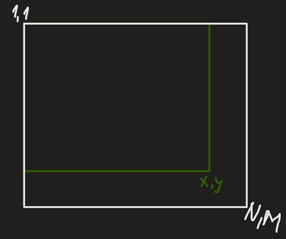
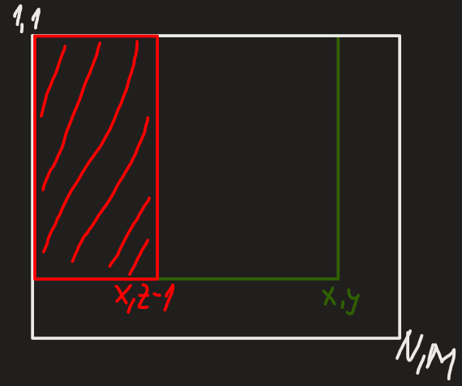
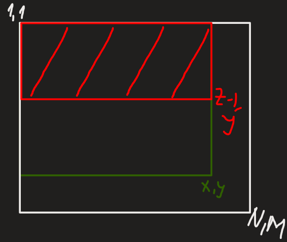
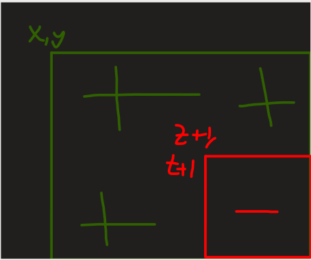
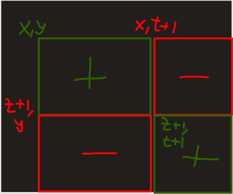

---
tags:
    - sume partiale
    - implementare
    - optimizare
    - difference arrays
    - mars
---

## Cunoștiințe necesare pentru înțelegerea completă a articolului:

* tablourile unidimensionale și parcurgerea lor
* tablourile bidimensionale și parcurgerea lor

## Problema inițială

Să presupunem că avem un șir $V$ de $N$ numere indexat de la $1$, iar asupra șirului primim mai multe întrebări de forma: _care este suma valorilor cuprinse între pozițiile $st$ și $dr$ (inclusiv) în șir?_

Răspunsul pentru această întrebare se poate calcula foarte ușor dacă realizăm parcurgerea efectivă a șirului de la poziția $st$ la poziția $dr$ și ne-ar lua $O(N)$ pași în cel mai rău caz ca să răspundem la o întrebare, complexitatea finală a programului ajungând la $O(N \cdot Q)$, ceea ce pentru valori mai mari de $10^4$ pentru $N$ și $Q$ ar depăși limitele de timp la majoritatea problemelor de algoritmică. Așadar, este nevoie de o optimizare, care se numește _„Sume parțiale”_.

## Prezentarea conceptului

Sumele parțiale reprezintă o optimizare pentru algoritmii care trebuie să afle o sumă pe un interval, iar pe acel interval **nu** se produc modificări. Considerăm: $sp[i] =$ suma valorilor de pe prefixul $1, 2, \dots, i$

Tabloul se calculează în felul următor:

```cpp
for (int i = 1; i <= n; i++) {
    sp[i] = sp[i - 1] + v[i];
}
```

După calculare, putem începe să răspunem la întrebări. Răspunsul nostru pentru un interval $[st, dr]$, unde $1 \leq st \leq dr \leq n$ va fi: $suma \ = sp[dr] - sp[st - 1]$

Faptul că răspunsul nostru este dat de o formulă, va face ca timpul nostru efectuat pentru rezolvarea unei întrebări să fie constant $O(1)$, ceea ce va duce ca programul nostru să aibă o complexitate finală $O(N + Q)$, pentru calcularea tabloului $sp$ și pentru citirea și răspunderea la întrebări. Totuși, hai să vedem de ce formula menționată mai sus funcționează. 

Pentru demonstrație, vom încerca o abordare grafică a formulei. Primul pas constă în adunarea sumei prefixului $1, 2, \dots, dr$.


Apoi, va trebui să scădem prefixul $1, 2, \dots, st - 1$.


În final, subsecvența $st, st + 1, \dots, dr - 1, dr$ va fi alcătuită din acele poziții care se află în segmentul _verde_ (prefixul $1, 2, \dots, dr$), dar care nu se află și în segmentul _roșu_ (prefixul $1, 2, \dots, st - 1$). Așadar, în urma acestei delimitări o să obținem suma cerută pe intervalul nostru.

## Extinderea sumelor parțiale pe matrice

De asemenea, sumele parțiale se pot extinde și pe tablouri bidimensionale. Să presupunem că lucrăm cu matricea $A$ care are $N$ linii și $M$ coloane. Vom defini _matricea_ $sp$ în felul următor: 

$sp[i][j] =$ suma valorilor aflate în submatricea care are colțul stânga-sus de coordonate $(1, 1)$ și colțul dreapta-jos de coordonate $(i, j)$

Față de cazul $1D$, aici vom începe cu demonstrația formulei de calcul a unei sume pe o submatrice, apoi vom și arăta cum se va calcula matricea $sp$. Vom analiza niște cazuri particulare de submatrice, apoi vom enunța o formulă finală.

Pentru început, datorită modului în care am definit matricea $sp$, primul caz particular pe care îl vom analiza va fi calcularea sumei de pe o submatrice care are colțul stânga-sus de coordonate $(1, 1)$ și colțul dreapta-jos de coordonate $(x, y)$. Răspunsul în acest caz va fi $sp[x][y]$, deoarece fix acest lucru ne este calculat de către matricea $sp$.



$suma = sp[x][y]$

Acum, să analizăm următorul caz: ni se cere să aflăm suma valorilor dintr-o submatrice care are colțul stânga-sus de coordonate $(1, z)$ și colțul dreapta-jos de coordonate $(x, y)$. Formula menționată mai sus nu este corectă, dar este un punct de plecare. Noi vom conține o submatrice în plus în cea determinată de colțurile de coordonate $(1, 1)$ și $(x, y)$, anume cea determinată de colțurile $(1, 1)$ și $(x, z - 1)$. Așadar, după adunarea sumei date de $sp[x][y]$ va fi nevoie să scădem $sp[x][z - 1]$.



$suma = sp[x][y] - sp[x][z - 1]$

Asemenea cazului precedent este si cazul în care noi dorim să aflăm suma unei submatrice care are colțurile $(z, 1)$ și $(x, y)$. Similar, $sp[x][y]$ nu este suficient, dar este un punct de plecare. Față de cazul precedent, submatricea \emph{în plus} este cea determinată de colțurile $(1, 1)$ și $(z - 1, y)$. În final, formula pentru acest caz va fi $sp[x][y] - sp[z - 1][y]$.

% lasa imaginile vietii asa, vad eu cum le refac, dar tot ar fi util sa pui referinte (gen "In fig.~\ref{fig:sp5} vorbim de Scufita Rosie" nuj)



$suma = sp[x][y] - sp[z - 1][y]$

Acum, putem încerca să deducem o formulă pentru orice submatrice. Să considerăm submatricea determinată de colțurile stânga-sus de coordonate $(x, y)$ și dreapta-jos de coordonate $(z, t)$. Dacă ar fi să adunăm formulele demonstrate în ultimele două cazuri $(sp[z][t] - sp[x - 1][t] - sp[z][y - 1])$, noi o să scădem de două ori suma din submatricea determinată de colțurile $(1, 1)$ și $(x - 1, y - 1)$, în timp ce noi o adunăm doar o dată. Așadar, la formulă se va aduna și suma din submatricea respectivă, pentru a compensa deficitul.


$suma = sp[z][t] - sp[z][y - 1] - sp[x - 1][t] + sp[x - 1][y - 1]$

Cu un raționament asemănător celui pentru determinarea formulei pentru cazul general, vom determina și cum se calculează matricea $sp$. Să presupunem că vrem să aflăm $sp[i][j]$. Mai întâi vom porni de la a scrie formula pentru a afla suma valorii de pe poziția $(i, j)$ în matrice (valoare pe care noi o și stim!):

$sp[i][j] - sp[i - 1][j] - sp[i][j - 1] + sp[i - 1][j - 1] = A[i][j]$

Trecem toți termenii, cu excepția lui $sp[i][j]$, în dreapta și obținem:

$sp[i][j] = sp[i - 1][j] + sp[i][j - 1] - sp[i - 1][j - 1] + A[i][j]$

Deci, tabloul $sp$ se poate calcula destul de ușor în timp $O(N \cdot M)$. Atașăm, mai jos, o secvență de cod în care se calculează matricea $sp$.

```cpp
for (int i = 1; i <= n; i++) {
    for (int j = 1; j <= m; j++) {
        sp[i][j] = sp[i - 1][j] + sp[i][j - 1] - sp[i - 1][j - 1] + a[i][j];
    }
}
```

## Șmenul lui Mars

Să considerăm următoarea problemă: se dă o axă și $K$ intervale de forma $[st, dr]$. Ni se dau după $Q$ întrebări de forma: câte intervale conțin în interiorul lor punctul $x$ de pe axă? 

O soluție foarte ineficientă ar fi pentru fiecare întrebare să luăm fiecare interval în parte și să verificăm dacă punctul nostru este inclus sau nu în interval. Soluția este ușor de intuit și de implementat, dar programul nostru ar avea complexitate $(Q \cdot K)$. Șmenul lui Marius Andrei (_Mars_) ne poate rezolva această problemă în timp constant, chiar și dacă o extindem pe mai multe dimensiuni (două axe, $3$ axe etc.).

Șmenul lui Mars permite efectuarea operațiilor de adăugare a unei valori la toate elementele dintr-un interval (sau o submatrice, pentru cazul în care lucrăm cu o matrice), **fără posibilitatea de a primi întrebări între operațiile de adăugare** (pentru acest tip de problemă se vor utiliza arborii de intervale, o tehnică care va fi prezentată ulterior). Când primim actualizările, noi vom efectua niște adunări și niște scăderi pentru a delimita bucata din șir / matrice pe care se efectuează operația. Apoi, valorile efective din structura noastră de date se vor calcula asemănător sumelor parțiale, fapt ce ne poate intui într-o modalitate cum vom efectua aceste operații.

### Șmenul lui Mars 1D

Primul pas când aplicăm Șmenul lui Mars unui șir, va trebui să luăm fiecare interval în parte și să delimităm bucata din șir pe care efectuăm operația. Pentru intervalul de poziții $[x, y]$, vom actualiza în șmen cu $+1$ la poziția $x$, ca să ilustrăm că a început un nou interval, și cu $-1$ la poziția $y + 1$ pentru a arăta faptul că intervalul nostru nu cuprinde și poziția $y + 1$. Astfel, vom avea:

```cpp
mars[x]++;
mars[y + 1]--;
```

unde vectorul $mars[]$ reprezintă adunările / scăderile din șmen. Așa cum am zis și mai sus, noi calculăm valorile noastre din șir ca la sumele parțiale, deci, se poate afirma că: $v[i] = mars[1] + mars[2] + \dots + mars[i]$

Dupa efectuarea tuturor operațiilor de adăugare pe interval, noi vom calcula printr-o parcurgere simplă valorile din șirul $V$:

```cpp
for (int i = 1; i <= n; i++) {
    mars[i] += mars[i - 1];
    v[i] = mars[i];
}
```

Atenție la faptul că suma pe prefixul $1, 2, \dots, i$ va fi ținută în $mars[i]$. Revenind la problema noastră inițială, răspunsul la fiecare întrebare va fi în $mars[x]$, astfel obținând \bigO{1} pe query. Evident, dacă vrem să adăugăm o valoare $z$ în loc de $1$ pe interval, acest lucru se poate realiza foarte ușor:

```cpp
mars[x] += z;
mars[y + 1] -= z;
/// cod din program
for (int i = 1; i <= n; i++) {
    mars[i] += mars[i - 1];
    v[i] += mars[i];
}
```

Codul de mai sus poate să susțină și updateuri pe un șir inițial nevid. Dacă problema noastră nu are suficientă memorie pentru menținerea șirului, aceste plusuri și minusuri se pot reține ca evenimente, care se pot sorta după poziție pentru efectuarea lor. Nu o să intrăm în profunzime momentan cu această tehnică, dar o lăsăm ca temă pentru studiu cititorului.

### Șmenul lui Mars 2D

Șmenul lui Mars aplicat pe o matrice presupune înțelegerea mai profundă a cum se _propagă_ sumele parțiale pe matrice. Să presupunem că avem submatricea delimitată de colțurile $(x, y)$ și $(z, t)$. Dacă o să facem doar o adunare și o scădere ca la cazul liniar din șmenul lui Mars, propagările noastre vor fi foarte eronate. Să privim în desen de ce:



O să avem, în plus, multe elemente care sunt actualizate. De aceea, se va proceda în felul următor: se va păstra adunarea de la $mars[x][y]$ și se va scădea la $mars[z + 1][y]$ și $mars[x][t + 1]$. Încă nu este complet, fiindcă pe submatricea $(z + 1, t + 1), (N, M)$ vor fi o adunare și două scăderi, deci acum scădem mai mult decât ar trebui, deci va trebui să adunăm și la $mars[z + 1][t + 1]$.



În cod, ar arăta în felul următor:

```cpp
mars[x][y] += k;
mars[z + 1][y] -= k;
mars[x][t + 1] -= k;
mars[z + 1][t + 1] += k;
/// cod din program
for (int i = 1; i <= n; i++) {
    for (int j = 1; j <= m; j++) {
        mars[i][j] += mars[i - 1][j] + mars[i][j - 1] - mars[i - 1][j - 1];
        a[i][j] += mars[i][j];
    }
}
```

În final, în urma operațiilor de adăugare, dacă vrem să știm ce valoare se află pe poziția $(i, j)$, răspunsul va fi dat de $A_{i, j}$.

Șmenul lui Mars poate fi extins și pe $3$ dimensiuni sau chiar mai multe, iar abordarea pe mai multe dimensiuni se va realiza identic, dar o să fie rar întâlnit în problemele de algoritmică cazuri în care să se ceară șmenul lui Mars pe mai mult de două dimensiuni.

## Concluzii și probleme suplimentare 

Sumele parțiale sunt o optimizare cheie în algoritmică, ajutându-ne să transformăm lucruri precum aflarea unei sume pe un interval dintr-o întreagă parcurgere într-o simplă formulă, cu timp constant de răspuns.

Pentru aprofundarea algoritmilor prezentați mai sus, recomand rezolvarea următoarelor probleme și articole:

### Probleme de la olimpiade

* [Prefix Sums 1D](https://kilonova.ro/problems/2129/)
* [plaja ONI 2010](https://kilonova.ro/problems/1334)
* [gradina ONI 2013](https://kilonova.ro/problems/1401)
* [Breed Counting USACO Silver](https://usaco.org/index.php?page=viewproblem2&cpid=572)
* [flip01 RoAlgo PreOJI 2024](https://kilonova.ro/problems/2379/)
* [sirpal RoAlgo PreOJI 2024](https://kilonova.ro/problems/2355/)
* [cdcq RoAlgo Contest #1](https://kilonova.ro/problems/662)
* [infoarena mostenire2](https://infoarena.ro/problema/mostenire2)
* [infoarena bmatrix](https://www.infoarena.ro/problema/bmatrix)
* [tnia OJI 2018](https://kilonova.ro/problems/892)
* [balon ONI 2023](https://kilonova.ro/problems/547)
* [poseidon RoAlgo Contest #4](https://kilonova.ro/problems/1018)
* [investiție OJI 2023](https://kilonova.ro/problems/134)
* [Probleme cu sume parțiale](https://kilonova.ro/tags/355)
* [Probleme cu șmenul lui Mars](https://kilonova.ro/tags/375)
* [Subsequences Summing to Sevens USACO Silver](https://usaco.org/index.php?page=viewproblem2&cpid=595)
* [Haybale Stacking USACO Bronze](https://www.spoj.com/problems/HAYBALE/)
* [ONI 2024 Eras](https://kilonova.ro/problems/2653/)
* [Painting the Barn USACO Gold](http://www.usaco.org/index.php?page=viewproblem2&cpid=923)


### Probleme de pe Codeforces

* [Good Subarrays - Codeforces](https://codeforces.com/contest/1398/problem/C)
* [Running Miles - Codeforces](https://codeforces.com/contest/1826/problem/D)
* [Irreductible Anagrams](https://codeforces.com/contest/1291/problem/D)
* [Nusret Gokce](https://codeforces.com/gym/104114/problem/N)
* [Constant Palindrome Sum - Codeforces](https://codeforces.com/contest/1343/problem/D)
* [Two Pointers Step 3 - Codeforces EDU](https://codeforces.com/edu/course/2/lesson/9/3/practice)
    

## Bibliografie și lectură suplimentară

* [Sume parțiale - CPPI](https://cppi.sync.ro/materia/sume_partiale.html)
* [Trucul lui Mars - CPPI](https://cppi.sync.ro/materia/trucul_lui_mars.html)
* [Prefix Sums - USACO Guide](https://usaco.guide/silver/prefix-sums?lang=cpp)
* [More on Prefix Sums](https://usaco.guide/silver/more-prefix-sums?lang=cpp)
* [An Introduction to Difference Arrays](https://codeforces.com/blog/entry/78762)